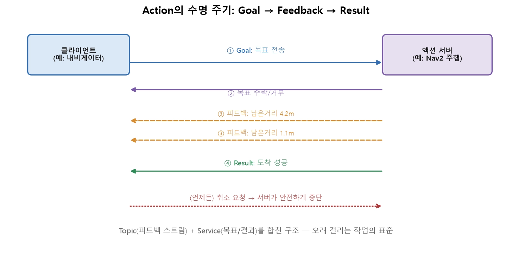
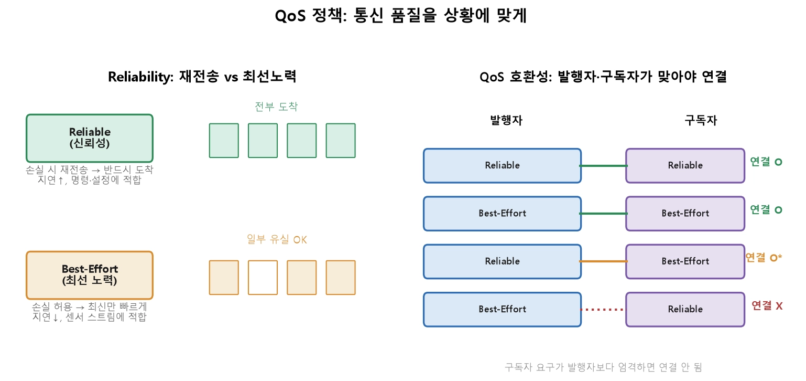
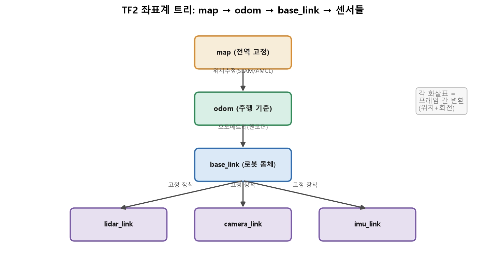

260812
=============
## 9장

```python
rclpy.spin(node)        # 이벤트를 기다리며 콜백을 계속 실행 (블로킹)
```

> 단일 스레드 : 한 콜백이 오래 걸리면 다른 콜백이 전부 밀림  
> (콜백 블로킹)  
> 
> 멀티스레드 executor : 1 대 다 구조  
>> MutuallyExclusive(상호 배타) 그룹 : 그룹은 서로 동시에 실행되지 않습니다. 같은 데이터를 만지는 콜백들을 묶어 경쟁 상태 방지  
>> Reentrant(재진입) 그룹 : 자유롭게 병렬 실행. 서로 독립적인 콜백에 씁니다.  
>>spin_once(node, timeout_sec=...) : 대기 중인 콜백을 한 번만 처리하고 반환. 다른 루프와 통합.  
>>spin_until_future_complete(node, future) : 특정 비동기 작업이 끝날 때까지.

## 10장

>Topic : 단방향, 비동기, 다대다 통신
>>구독한 모든 노드가 각자 수령  
>> Topic이 맞는 경우 : 센서 스트림, 상태 방송, 제어 명령처럼 계속 흘려보내는 데이터. "받는 쪽이 있든 없든 계속 발행".  
>> Topic이 아닌 경우 : "이 값을 계산해서 결과를 돌려줘"(→ Service, 11강), "오래 걸리는 작업을 시키고 진행상황을 받아"(→ Action, 11강).

> 큐 깊이
> > 센서 스트림(빠른 데이터): 깊이를 작게. 늦게 처리할 바엔 최신만. 오래된 LiDAR 스캔은 쓸모 X.  
> > 놓치면 안 되는 명령 : 깊이를 충분히. 다만 신뢰성은 큐 깊이보다 QoS 정책
>


```c++
#include "rclcpp/rclcpp.hpp"
#include "geometry_msgs/msg/twist.hpp"
using namespace std::chrono_literals;

class VelocityPublisher : public rclcpp::Node {
public:
    VelocityPublisher() : Node("velocity_publisher") {
        pub_ = create_publisher<geometry_msgs::msg::Twist>("/cmd_vel", 10);
        timer_ = create_wall_timer(50ms, [this]{ tick(); });
    }
private:
    void tick() {
        geometry_msgs::msg::Twist msg;
        msg.linear.x = 0.2;
        pub_->publish(msg);
    }
    rclcpp::Publisher<geometry_msgs::msg::Twist>::SharedPtr pub_;
    rclcpp::TimerBase::SharedPtr timer_;
};

int main(int argc, char** argv) {
    rclcpp::init(argc, argv);
    rclcpp::spin(std::make_shared<VelocityPublisher>());  // shared_ptr!
    rclcpp::shutdown();
}
```
```shell
# 두 개의 터미널에서 (각각 source 후)
ros2 run my_package velocity_publisher
ros2 run my_package velocity_subscriber

# 다른 터미널에서 관찰
ros2 topic list                    # /cmd_vel 이 보이는지
ros2 topic echo /cmd_vel           # 실제 메시지 내용 출력
ros2 topic hz /cmd_vel             # 20Hz로 나오는지 (2강의 주기 검증!)
ros2 topic info /cmd_vel           # 발행자·구독자 수

ros2 topic pub /cmd_vel geometry_msgs/msg/Twist "{linear: {x: 0.2}}" --rate 10      # 일회성
```

## 11장

|질문	                         |답|→|패턴|
|-------------------------------|--|-|----|
|결과를 돌려받아야 하나?             |아니오|→|Topic|
|결과를 돌려받되, 즉시 끝나나?        |예|→|Service|
|오래 걸리고, 진행상황·취소가 필요한가? |예|→|Action|
|노드의 설정값을 다루나?             |예|→|Parameter|

> Service : 한 번의 요청 → 한 번의 응답 구조  
>  >.srv 인터페이스로 정의  
>  >---로 요청과 응답 구분
```bash 
# AddTwoInts.srv
int64 a          # 요청(Request)
int64 b
---
int64 sum        # 응답(Response)
```
```python
##서버 코드
class AddServer(Node):
    def __init__(self):
        super().__init__('add_server')
        self.srv = self.create_service(AddTwoInts, 'add_two_ints', self.on_request)

    def on_request(self, request, response):
        response.sum = request.a + request.b
        return response          # 이 값이 클라이언트로 돌아감
```
```bash
##클라이언트 코드
future = client.call_async(request)                 # 비동기 요청
rclpy.spin_until_future_complete(node, future)      # 응답까지 spin
result = future.result()

##CLI
ros2 service list
ros2 service call /add_two_ints example_interfaces/srv/AddTwoInts "{a: 3, b: 4}"
```


>① 클라이언트가 목표(Goal) 전송.  
>② 서버가 수락 또는 거부.  
>③ 수행하는 동안 서버는 피드백(Feedback) 반복 전송.  
>④ 완료되면 결과(Result) 반환.  
>⑤ 취소를 요청하면 서버가 안전하게 중단.  

>Action = Service(목표/결과) + Topic(피드백 스트림)
```bash
# NavigateToPose.action (개념 예시)
geometry_msgs/Pose target      # Goal: 목표 지점
---
bool success                   # Result: 성공 여부
---
float32 distance_remaining     # Feedback: 남은 거리 (반복 전송)
```
```python
## Parameter
class ControlNode(Node):
    def __init__(self):
        super().__init__('control_node')
        self.declare_parameter('max_speed', 0.8)          # 선언 + 기본값
        self.declare_parameter('kp', 1.2)

    def tick(self):
        max_speed = self.get_parameter('max_speed').value  # 조회
        ...
```

```bash
ros2 param list                                  # 파라미터 목록
ros2 param get /control_node max_speed           # 값 조회
ros2 param set /control_node max_speed 0.5       # 실행 중 변경!
```

## 13장


>ROS1 : roscore(중앙 관리자) 존재, 마비 시 전체 통신이 마비됐지만(단일 장애점)  
>ROS2 : 중앙 관리자(마스터)가 없고 같은 네트워크에서 자동으로 발견 후 직접 연결.



### Reliability — 신뢰성

>Reliable : 유실 시 재전송, 확실하지만 지연 가능  
>Best-Effort : 유실을 허용하고 최신 것을 빠르게 전송, 빠르지만 일부 누락  
>발행자와 구독자가 호환되어야 연결

### Durability — 지속성

>Volatile(휘발성) : 접속 후 오는 메시지만
>Transient Local(지속) : 발행자가 마지막 메시지를 보관, 전달

### History — 이력(큐)

>Keep Last (depth N) : 최근 N개만 보관.
>Keep All : 가능한 한 모두 보관(자원 한도 내).

### QoS 프로파일
|프로파일|구성|용도|
|------|---|---|
|Default|Reliable, Volatile, KeepLast(10)|일반 통신(명령 등)
|Sensor Data|Best-Effort, Volatile, KeepLast(5)|카메라·LiDAR 스트림|
|Services|Reliable|서비스 통신|
|Parameters|Reliable|파라미터|

```python
from rclpy.qos import qos_profile_sensor_data
# 센서 데이터엔 전용 프로파일
self.sub = self.create_subscription(
    LaserScan, '/scan', self.on_scan, qos_profile_sensor_data)
```

### QoS 호환성
```bash
ros2 topic info /scan --verbose    # 발행자·구독자의 QoS를 상세 표시
```

## 14장



> map: 방/건물에 고정된 전역 기준.
>>"절대 위치"의 기준.  

>odom : 로봇의 출발점 기준으로 엔코더(바퀴 회전)로 추정한 위치.
>>부드럽지만 시간이 지나면 오차가 누적(미끄러짐 등).  

>base_link : 로봇 몸체의 기준점.
>>모든 센서가 여기에 상대적으로 고정 장착.  

>센서 링크들 : 각 센서의 위치.
>>base_link에 대해 고정(로봇에 나사로 박혀 있으니).

```shell
ros2 launch urdf_tutorial display.launch.py model:=
```

### urdf

```xml
<?xml version="1.0"?>
<robot name="my_robot">

    <link name="base_footprint"/>
  <link name="base_link">
    <visual>
      <geometry>
        <box size="1 1 0.5"/>
      </geometry>
      <origin xyz="0 0 0" rpy="0 0 0"/>
    </visual>
  </link>

  <link name="lidar">
    <visual>
      <geometry>
        <cylinder radius="0.05" length="0.1"/>
      </geometry>
      <origin xyz="0 0 0" rpy="0 0 0"/>
    </visual>
  </link>
<link name="left_wheel">
    <visual>
      <geometry>
        <cylinder radius="0.2" length="0.05"/>
      </geometry>
      <origin xyz="0 0 0" rpy="0 1.5735 0"/>
    </visual>
  </link>

  <link name="right_wheel">
    <visual>
        <geometry>
            <cylinder radius="0.2" length="0.05"/>
        </geometry>
        <origin xyz="0 0 0" rpy="1.5735 0 1.5735"/>
    </visual>
  </link>
  <joint name="left_wheel_joint" type="continuous">
    <parent link="base_link"/>
    <child link="left_wheel"/>
    <origin xyz="-0.525 0.3 -0.2" rpy="0 0 0"/>
    <axis xyz="1 0 0"/>
    </joint>

    <joint name="right_wheel_joint" type="continuous">
        <parent link="base_link"/>
        <child link="right_wheel"/>
        <origin xyz="0.525 0.3 -0.2" rpy="0 0 0"/>
        <axis xyz="1 0 0"/>
    </joint>
    <joint name="lidar_joint" type="fixed">
        <parent link="base_link"/>
        <child link="lidar"/>
        <origin xyz="0 0 0.3" rpy="0 0 0"/>
    </joint>

    <joint name="base_footprint_joint" type="fixed">
        <parent link="base_footprint"/>
        <child link="base_link"/>
        <origin xyz="0 0 0.4" rpy="0 0 0"/>
    </joint>
</robot>
```


# URDF (Unified Robot Description Format) 문법 정리 — ROS 2 기준

URDF는 XML 기반으로 로봇의 링크(부품)와 조인트(관절)를 트리 구조로 기술합니다. ROS 2에서는 순수 URDF보다 **xacro**를 섞어 쓰는 게 사실상 표준입니다.

## 1. 최상위 구조

```xml
<?xml version="1.0"?>
<robot name="my_robot" xmlns:xacro="http://www.ros.org/wiki/xacro">
  <link name="..."/>
  <joint name="..." type="...">...</joint>
</robot>
```

- 루트 태그는 `<robot>`, `name` 속성 필수.
- 내부에 `<link>`와 `<joint>`를 여러 개 나열해 트리를 구성 (링크=노드, 조인트=엣지).
- 트리이므로 **부모 없는 최상위 링크(base_link)가 하나** 있어야 하고 순환 구조는 불가.

## 2. `<link>` — 물리적 부품

```xml
<link name="wheel_left">
  <visual>
    <origin xyz="0 0 0" rpy="0 0 0"/>
    <geometry>
      <cylinder radius="0.05" length="0.02"/>
      <!-- box size="x y z" / sphere radius / mesh filename="package://.../a.dae" -->
    </geometry>
    <material name="black">
      <color rgba="0 0 0 1"/>
    </material>
  </visual>

  <collision>
    <origin xyz="0 0 0" rpy="0 0 0"/>
    <geometry><cylinder radius="0.05" length="0.02"/></geometry>
  </collision>

  <inertial>
    <origin xyz="0 0 0" rpy="0 0 0"/>
    <mass value="0.5"/>
    <inertia ixx="0.001" ixy="0" ixz="0" iyy="0.001" iyz="0" izz="0.001"/>
  </inertial>
</link>
```

| 태그 | 역할 |
|---|---|
| `visual` | RViz 등에서 렌더링될 형상 (mesh 등 복잡한 모델 사용 가능) |
| `collision` | 충돌 계산용 형상 (보통 visual보다 단순화, 성능↑) |
| `inertial` | 질량·관성텐서 — **Gazebo/물리 시뮬레이션에 필수**, RViz만 쓸 거면 생략 가능 |

geometry 종류: `box`, `cylinder`, `sphere`, `mesh`(`.stl`, `.dae` 등, `package://` 경로 사용).

## 3. `<joint>` — 링크 간 연결

```xml
<joint name="wheel_left_joint" type="continuous">
  <parent link="base_link"/>
  <child link="wheel_left"/>
  <origin xyz="0 0.1 0" rpy="0 0 0"/>
  <axis xyz="0 1 0"/>
  <limit lower="-1.57" upper="1.57" effort="10" velocity="1.0"/>
  <dynamics damping="0.1" friction="0.0"/>
</joint>
```

**joint type** (필수):

| type | 설명 |
|---|---|
| `fixed` | 고정, 움직이지 않음 (센서 마운트 등) |
| `revolute` | 회전, 각도 제한 있음 (관절 로봇 팔) |
| `continuous` | 회전, 제한 없음 (바퀴) |
| `prismatic` | 직선 이동, 위치 제한 있음 (리니어 액추에이터) |
| `floating` | 6DOF 자유 이동 (거의 안 씀) |
| `planar` | 평면상 이동 |

- `origin`: child가 parent 좌표계 기준으로 어디에 붙는지 (xyz + rpy, 라디안)
- `axis`: revolute/continuous/prismatic에서 움직이는 축
- `limit`: revolute/prismatic에 필수 (`lower`, `upper`, `effort`, `velocity`)

## 4. ROS 2에서 흔히 같이 쓰는 확장

### xacro (매크로/변수)

```xml
<xacro:property name="wheel_radius" value="0.05"/>

<xacro:macro name="wheel" params="prefix reflect">
  <link name="${prefix}_wheel">
    ...
    <cylinder radius="${wheel_radius}" length="0.02"/>
  </link>
</xacro:macro>

<xacro:wheel prefix="left" reflect="1"/>
<xacro:wheel prefix="right" reflect="-1"/>

<xacro:include filename="$(find my_pkg)/urdf/sensors.xacro"/>
```

- `.urdf.xacro` 파일로 작성 후 `xacro robot.urdf.xacro > robot.urdf` 또는 launch 파일에서 `xacro.process_file()`로 변환해서 사용.
- 반복 구조(바퀴 4개, 손가락 등)를 매크로로 처리할 때 필수.

### `<ros2_control>` — 하드웨어 인터페이스 (ROS 2 전용)

```xml
<ros2_control name="MyRobotSystem" type="system">
  <hardware>
    <plugin>gazebo_ros2_control/GazeboSystem</plugin>
    <!-- 또는 실기체용 커스텀 hardware_interface 플러그인 -->
  </hardware>
  <joint name="wheel_left_joint">
    <command_interface name="velocity"/>
    <state_interface name="position"/>
    <state_interface name="velocity"/>
  </joint>
</ros2_control>
```

- `ros2_control`이 어떤 조인트를 command/state 인터페이스로 제어할지 선언.
- `hardware/plugin`에는 시뮬레이션용(`gazebo_ros2_control/GazeboSystem`) 또는 실제 하드웨어 드라이버 플러그인 지정.
- `command_interface`: 컨트롤러가 내려보내는 값 (position/velocity/effort).
- `state_interface`: 컨트롤러가 읽어오는 값 (position/velocity/effort).
- 실제 제어 알고리즘(예: `diff_drive_controller`, `joint_trajectory_controller`)은 별도 `controllers.yaml`에서 설정하고 `ros2_control_node`가 로드.

### `<gazebo>` 태그 (시뮬레이션 전용 설정)

```xml
<gazebo reference="wheel_left">
  <mu1>1.0</mu1>
  <mu2>1.0</mu2>
</gazebo>

<gazebo>
  <plugin filename="libgazebo_ros2_control.so" name="gazebo_ros2_control">
    <parameters>$(find my_pkg)/config/controllers.yaml</parameters>
  </plugin>
</gazebo>
```

- `reference` 속성으로 특정 링크에 마찰(`mu1`/`mu2`), 색상 등 Gazebo 전용 물리 속성 부여.
- `reference` 없이 쓰면 로봇 전체에 적용되는 플러그인 선언(예: `gazebo_ros2_control` 플러그인 로딩).

## 5. 일반적인 사용 흐름 (ROS 2)

1. `urdf/robot.urdf.xacro` 작성 (link, joint, xacro 매크로 포함)
2. `ros2_control` 태그로 제어 인터페이스 선언
3. `robot_state_publisher`가 URDF를 읽어 `/tf`, `/robot_description` 퍼블리시
4. `joint_state_publisher`(또는 실제 조인트 상태) → RViz에서 시각화
5. Gazebo 시뮬레이션 시 `<gazebo>` 플러그인이 `controllers.yaml`을 로드해 `ros2_control_node` 구동

## 6. 자주 하는 실수

- `inertial` 값이 0이거나 비현실적이면 Gazebo에서 로봇이 날아가거나 뒤집힘.
- `collision` 형상을 mesh 그대로 쓰면 물리 연산이 무겁고 불안정 → 단순 도형으로 근사 권장.
- `axis`의 방향과 `origin`의 `rpy` 좌표계를 혼동하기 쉬움 (axis는 child 링크 좌표계 기준).
- xacro `${}` 수식 안에서는 단위가 자동 변환되지 않으므로 항상 SI 단위(m, rad, kg) 통일 필요.