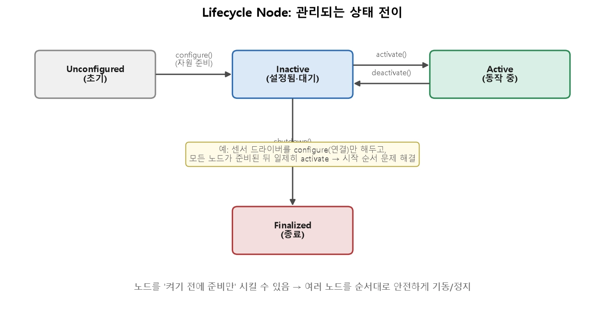
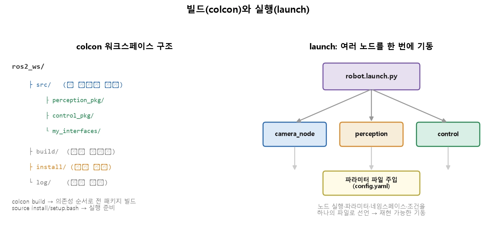
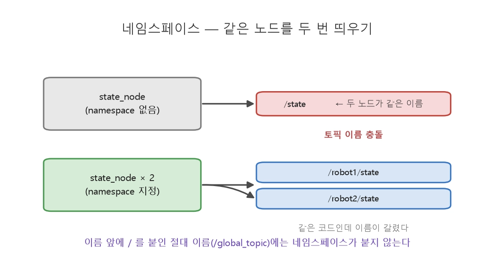
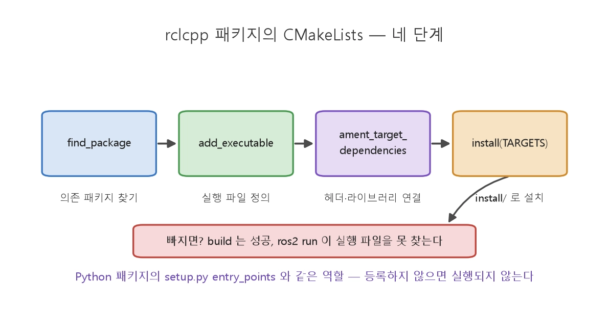
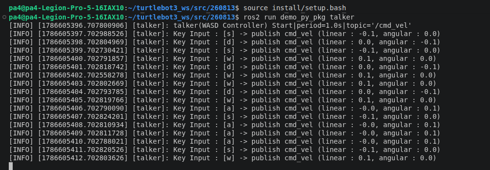

260813
=============
## 15장


> 모든 노드가 준비된 뒤 일제히 동작  
>Unconfigured(초기) → configure() →  
>Inactive(설정 완료, 대기) → activate()  
>→ Active(실제 동작) 순으로 전이

>시작 순서: 모든 노드를 configure(준비)  
>안전한 정지·재시작: 문제가 생긴 노드를 deactivate로 멈췄다가 다시 activate.
>자원 관리: configure에서 자원을 잡고, 각 상태 전이 콜백(on_configure, on_activate 등)에서 할 일을 명확히 나눔.

>Composition : 여러 노드를 하나의 프로세스에 함께 올리는 기법
>>메모리를 직접 공유

| |독립 프로세스 (기본)|Composition (합성)|
|-|----------------|-----------------|
|견고성|높음(하나 죽어도 격리)|낮음(같이 죽음)|
|통신 비용|복사·직렬화|메모리 공유(제로 카피)|
|적합|대부분의 노드|대용량 데이터를 주고받는 노드 묶음|

### colcon — 워크스페이스 빌드

>워크스페이스 : 여러 패키지(노드·인터페이스)를 한데 모은 것  
>colcon : 빌드하는 도구(setup.py를 의존성 순서대로 호출)

```shell
sudo apt install ros-humble-desktop python3-colcon-common-extensions -y
source /opt/ros/humble/setup.bash        # 이 터미널에만 적용 → ~/.bashrc 에 넣어 둔다
export ROS_DOMAIN_ID=26                  # 같은 네트워킹의 남의 노드와 섞이지 않게(13강)
```

|증상|원인|대우|
|---|---|---|
|Package 'x' not found|install/setup.bash 미소싱 또는 뱜드 실패|소싱 확인 → 뱜드 로그의 첫 에러부터 읽기|
|뱜드는 성공, ros2 run 이 실행 파일을 못 찾음|entry_points·install(TARGETS) 누락·오타|ros2 pkg executables <패키지> 로 등록 이름 확인|
|코드를 고쳐는데 예전 동작|--symlink-install 없이 뱜드|옵션 붙여 재뱜드|
|원인 불명의 뱜드 실패가 계속됨|이전 뱜드 캐시 오염|rm -rf build install log 후 새로 뱜드(최후 수단)|



```shell
cd ~/ros2_ws
colcon build                              # 전체 빌드 (의존성 순서 자동)
colcon build --packages-select control_pkg # 특정 패키지만
source install/setup.bash                  # 실행 환경 구성 (3강의 source!)
```
> launch : 하나의 파일로 선언해 한 번에 기동하는 것

```python
# robot.launch.py
from launch import LaunchDescription
from launch_ros.actions import Node

def generate_launch_description():
    return LaunchDescription([
        Node(package='camera_pkg', executable='camera_node'),
        Node(package='perception_pkg', executable='perception_node',
             parameters=[{'min_confidence': 0.7}]),          # 파라미터 주입(11강)
        Node(package='control_pkg', executable='control_node',
             parameters=['config/control.yaml']),            # 파일로 주입
    ])
```

```bash
ros2 launch robot_bringup robot.launch.py
```


```python
Node(package='sensor_pkg', executable='state_node', namespace='robot1'),
Node(package='sensor_pkg', executable='state_node', namespace='robot2'),
```

```bash
ros2 topic list
# /robot1/state
# /robot2/state
```

```yaml
# config/params.yaml
/**:                          # 모든 노드에 적용 (노드 이름을 적으면 그 노드만)
  ros__parameters:
    publish_rate: 10.0
    warn_distance: 3.0
```

```bash
ros2 param get /state_node publish_rate      # 주입된 값 확인
```


```shell
find_package(ament_cmake REQUIRED)
find_package(rclcpp REQUIRED)                     # 1) 의존 패키지 찾기
find_package(std_msgs REQUIRED)

add_executable(state_node src/state_node.cpp)     # 2) 실행 파일 정의
ament_target_dependencies(state_node rclcpp std_msgs)   # 3) 헤더·라이브러리 연결

install(TARGETS state_node DESTINATION lib/${PROJECT_NAME})   # 4) install/ 로 설치
ament_package()
```
>.msg 정의(12강) → colcon build(인터페이스→노드 순) → source install/setup.bash → ros2 launch(여러 노드 일괄 기동). 이것이 ROS2 프로젝트를 빌드하고 돌리는 표준 사이클

## 실습 내용

```shell
### 터틀봇 조작 키보드 실행
ros2 run turtlebot3_teleop teleop_keyboard

### 터틀봇 모델명 입력
export TURTLEBOT3_MODEL=waffle

### 터틀봇 시뮬레이터 가제보 실행
ros2 launch turtlebot3_gazebo turtlebot3_world.launch.py
```
## 위의 명령어로 가제보 시뮬레이션을 실행하고 아래의 코드로 "talker.py"를 실행하여 토픽명 'cmd_vel'으로 통신
[talker.py](260813_turtlebot/src/demo_py_pkg/demo_py_pkg/talker.py)

## 이는 turtlebot과 아래의 listener.cpp 실행, demo.launch.py에서 확인 가능
[demo.launch.py](260813_turtlebot/src/demo_bringup/launch/demo.launch.py)
[listener.cpp](260813_turtlebot/src/demo_cpp_pkg/src/listener.cpp)

```shell
### 아래 코드로 빌드 및 필요 파일 설치
colcon build
source install/setup.bash
### cmd_vel값 출력
ros2 topic echo /cmd_vel
### talker 실행
ros2 run demo_py_pkg talker
### demo_launch.py 실행
ros2 launch demo_bringup demo.launch.py
```
