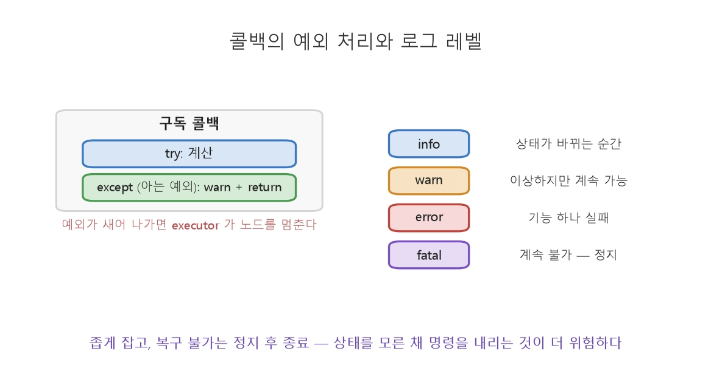
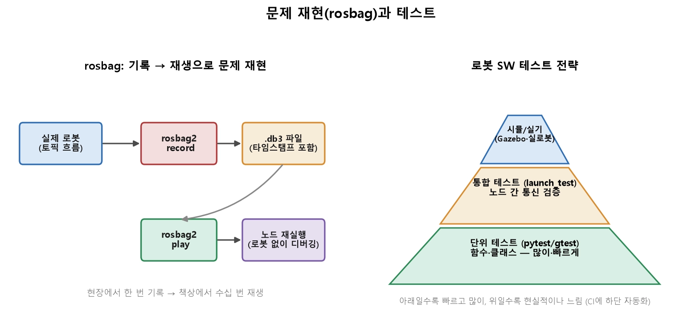
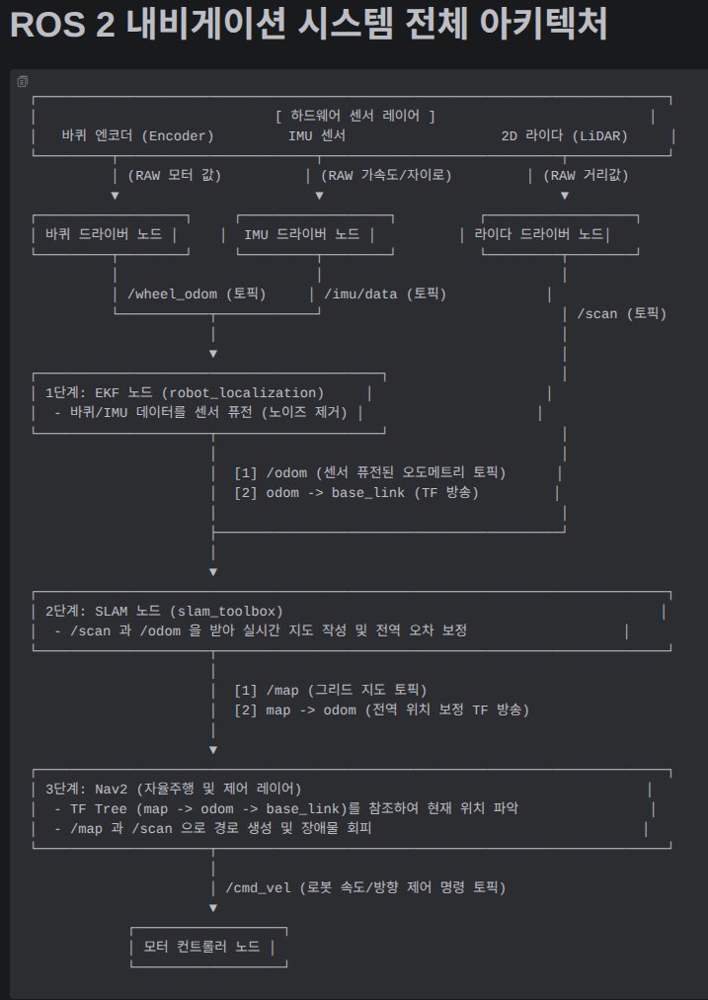

260814
=============
## 16장


>rqt_graph : 노드-토픽 연결 구조 출력  
>RViz2 : 센서와 TF로봇을 3D 시각화  
> rqt_plot : 수치를 그래프화  
> ros2 CLI : CLI로 ROS2로봇 시뮬레이션  
> rosbag2 : 데이터의 기록, 재생  
> log, rqt_console : logger메세지 필터 확인
```bash
ros2 topic list / echo / hz / info    # 토픽 존재·내용·주파수·QoS
ros2 node list / info                 # 노드와 그 연결
ros2 topic pub ...                    # 직접 메시지 주입해 테스트
rqt_graph                             # 노드-토픽 연결 시각화

### RViz
from visualization_msgs.msg import Marker

m = Marker()
m.header.frame_id = 'world'                  # 어느 좌표계 기준인가(14강)
m.header.stamp = self.get_clock().now().to_msg()
m.ns, m.id = 'waypoints', 0                  # 같은 ns+id 는 덮어쓰기, 다르면 따로 그림
m.type = Marker.SPHERE                       # SPHERE·CUBE·ARROW·LINE_STRIP·TEXT_VIEW_FACING
m.action = Marker.ADD
m.pose.position.x, m.pose.position.y = 2.0, 3.0
m.pose.orientation.w = 1.0                   # 회전 없음
m.scale.x = m.scale.y = m.scale.z = 0.2      # 크기 [m] — 0 이면 안 보인다
m.color.r, m.color.a = 1.0, 1.0              # a(알파) 0 이면 투명해서 안 보인다
self.marker_pub.publish(m)
```
### rosbag2

> rosbag2 : 토픽에 흐르는 모든 메시지를 타임스탬프와 함께 파일로 기록
```bash
ros2 bag record /scan /image /tf      # 지정 토픽 기록 (-a는 전체)
ros2 bag record -a -o field_test_01   # 전체를 이름 붙여 기록
ros2 bag play field_test_01           # 재생
ros2 bag info field_test_01           # 내용 요약(토픽·기간·메시지 수

ros2 bag play --loop test1
ros2 bag play test1 --ros--args -r /topic_name:=/받는파일 #test1의 topic_name 토픽을 받는파일로 publish
```


> 콜백 : 실패할 수 있는 최소한의 코드만
```shell
def on_scan(self, msg):
    try:
        d = self.nearest(msg)                 # 실패할 수 있는 계산
    except (ValueError, ZeroDivisionError):   # 대응 방법을 아는 예외만
        self.get_logger().warn('스캔 한 프레임 건너뜀')
        return                                # 다음 주기에 다시 시도
    self.publish(d)
```
> **좁게 잡습니다.**  
>>`except Exception` 으로 뭉뚱그리면 내가 만든 버그(`NameError` 등)까지 삼켜 원인을 못 찾습니다.  

>**복구 불가한 실패는 살려 두지 않습니다.**  
>>모터 통신이 끊겨 상태를 모르는 채 명령을 계속 내리는 것이 멈춘 로봇보다 위험합니다. 정지 명령을 보낸 뒤 종료합니다.  

> **종료 경로를 만듭니다.**  
>>`finally` 또는 `destroy_node()` 직전에 정지 명령과 포트 정리를 넣어 Ctrl+C 로도 안전하게 내려오게 합니다.

>rqt_console : 레벨을 붙여 어느 노드에서 나온 로그인지 필터링.

|레벨|언제|로봇 예|
|---|---|------|
|debug|개발 중 상세 추적|매 주기 중간값|
|info|상태가 바뀌는 순간|"라이다 연결됨", "목표 도달"|
|warn|이상하지만 계속 가능|"스캔 3개 누락"|
|error|기능 하나가 실패|"지도 저장 실패"|
|fatal|계속할 수 없음|"모터 통신 단절 — 정지"|

>상태 변화만 info, 반복되는 이상은 횟수로 묶어 warn


```python
# test_safety.py
from robot_utils.safety import compute_stop_distance

def test_stop_distance_zero_speed():
    assert compute_stop_distance(0.0) == 0.0

def test_stop_distance_increases_with_speed():
    assert compute_stop_distance(2.0) > compute_stop_distance(1.0)

def test_stop_distance_formula():
    # v=1.0, decel=1.5 → 1.0/(2*1.5)
    assert abs(compute_stop_distance(1.0) - 1/3) < 1e-6
```
```bash
pytest test_safety.py -v
```
```c++
#include <gtest/gtest.h>
#include "robot_utils/safety.hpp"

TEST(SafetyTest, ZeroSpeed) {
    EXPECT_DOUBLE_EQ(computeStopDistance(0.0), 0.0);
}
TEST(SafetyTest, IncreasesWithSpeed) {
    EXPECT_GT(computeStopDistance(2.0), computeStopDistance(1.0));
}
```
