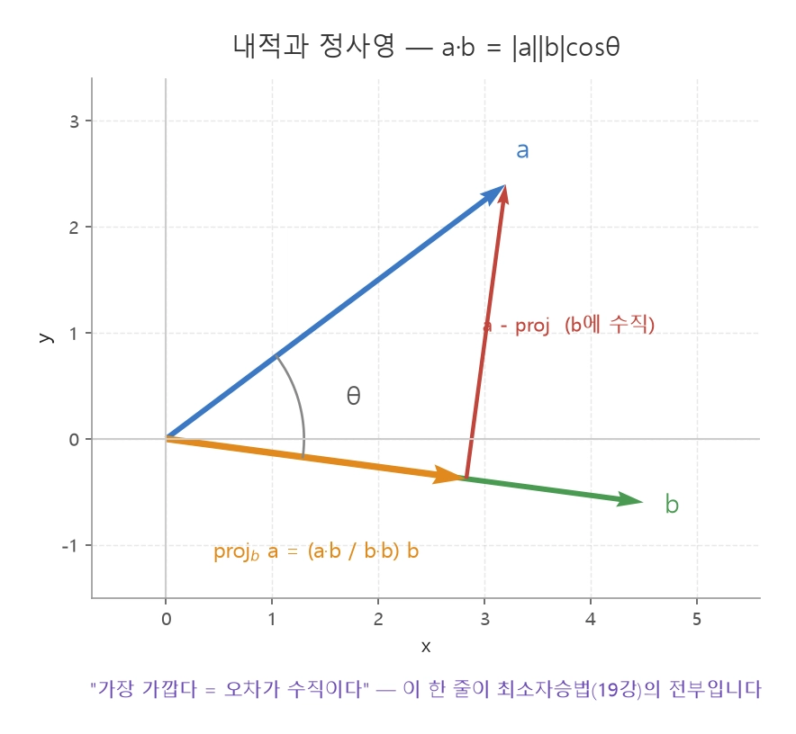
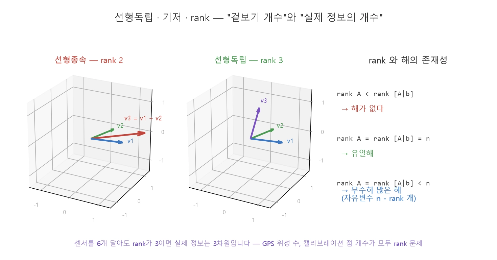

260818
=============
## 17장
### 행렬

>전치 : 행과 열을 맞바꾼 것  
>대칭행렬 : 관성 텐서·강성행렬·공분산 행렬처럼 공학의 핵심 행렬이 대부분 속하는 부류  
>반대칭행렬 : 3차원 회전의 각속도가 갖는 형태  

$$A = \underbrace{\tfrac{1}{2}(A + A^{\top})}_{\text{대칭}} + \underbrace{\tfrac{1}{2}(A - A^{\top})}_{\text{반대칭}}$$

$$[\mathbf{a}]_\times = \begin{bmatrix} 0 & -a_3 & a_2 \\ a_3 & 0 & -a_1 \\ -a_2 & a_1 & 0 \end{bmatrix}, \qquad \mathbf{a}\times\mathbf{b} = [\mathbf{a}]_\times \mathbf{b}$$

### 내적
$$\mathbf{a} \cdot \mathbf{b} = a_x b_x + a_y b_y + a_z b_z = |\mathbf{a}|\,|\mathbf{b}|\cos\theta$$
>숫자 곱의 합이라는 대수적 정의와, 크기·각도로 표현한 기하적 정의가 같은 값

>두 방향 사이 각도 : $\theta = \arccos\dfrac{\mathbf{a}\cdot\mathbf{b}}{|\mathbf{a}||\mathbf{b}|}$, 로봇 진행 방향과 목표 방향의 각도 차이.  
>수직 판정 : $\mathbf{a}\cdot\mathbf{b}=0$ 이면 직교. 회전행렬의 축들이 서로 수직인지 확인할 때.
>정사영(projection) : 벡터를 특정 방향 성분과 그에 수직인 성분으로 분해

$\text{proj}_{\mathbf{b}}\,\mathbf{a} = \frac{\mathbf{a}\cdot\mathbf{b}}{\mathbf{b}\cdot\mathbf{b}}\,\mathbf{b}$

### 외적
$\mathbf{a} \times \mathbf{b} = \begin{bmatrix} a_y b_z - a_z b_y \\ a_z b_x - a_x b_z \\ a_x b_y - a_y b_x \end{bmatrix}, \qquad |\mathbf{a}\times\mathbf{b}| = |\mathbf{a}||\mathbf{b}|\sin\theta$
#### ROS2에서의 사용
>평면의 법선 : 바닥·테이블 위 세 점으로 평면의 수직 방향  
>회전축 : 두 자세 사이의 회전축이 외적  
>좌표축 생성 : 두 방향만 알 때 세 번째 축을 외적으로 만들어 직교 좌표계를 완성  
>넓이·방향 판정 : 세 점이 이루는 삼각형의 넓이, 점이 선의 어느 쪽에 있는지 판정  

### 선형독립과 rank

$c_1\mathbf{v}_1 + c_2\mathbf{v}_2 + \cdots + c_k\mathbf{v}_k = \mathbf{0}$

#### 차원 정리

$\text{rank}(A) + \dim N(A) = n \quad (n = \text{열의 개수})$

#### 회전행렬의 "성질"을 검증

> 각 열은 단위벡터 : $\mathbf{r}_i \cdot \mathbf{r}_i = 1$ (내적으로 확인)
> 서로 수직 : $\mathbf{r}_i \cdot \mathbf{r}_j = 0\ (i \neq j)$ (내적으로 확인)
> 오른손 좌표계 : $\mathbf{r}_1 \times \mathbf{r}_2 = \mathbf{r}_3$ (외적으로 확인)