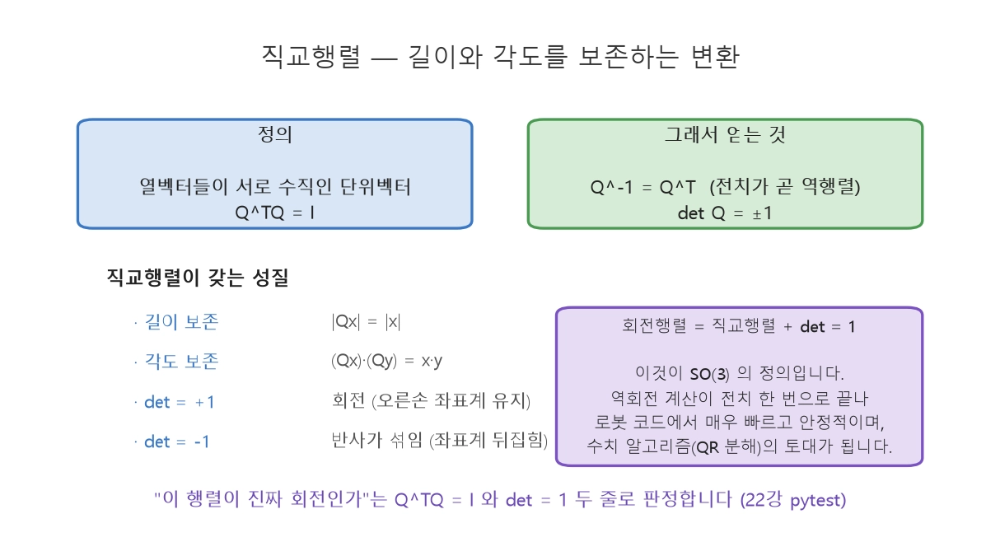
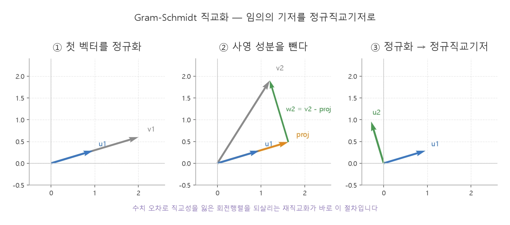
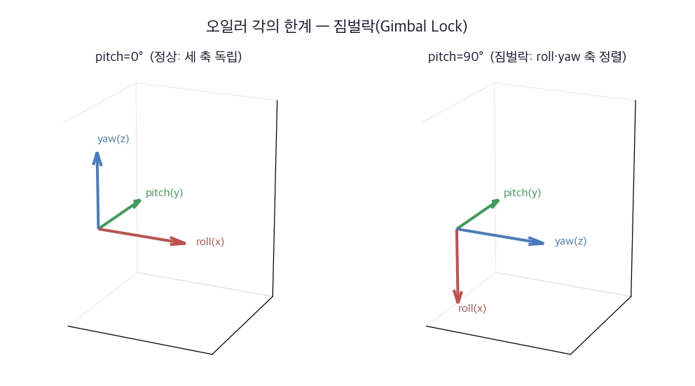

260819
=============
## 18장

### 선형변환
선형변환 : $T(\mathbf{u}+\mathbf{v}) = T(\mathbf{u}) + T(\mathbf{v})$,  
$T(c\,\mathbf{u}) = c\,T(\mathbf{u})$ 를 만족

$$\mathbf{x} = x_1\mathbf{e}_1 + x_2\mathbf{e}_2 \quad\Longrightarrow\quad T(\mathbf{x}) = x_1 T(\mathbf{e}_1) + x_2 T(\mathbf{e}_2)$$

|변환|행렬|행렬식|특징|
|---|---|-----|---|
|회전 $R(\theta)$|$\begin{bmatrix}\cos\theta & -\sin\theta\\ \sin\theta & \cos\theta\end{bmatrix}$|$1$|길이·각도 보존|
|신축|$\begin{bmatrix}s_x & 0\\ 0 & s_y\end{bmatrix}$|$s_x s_y$|축별 배율|
|전단(x방향)|$\begin{bmatrix}1 & k\\ 0 & 1\end{bmatrix}$|$1$|넓이는 보존, 각도는 변형|
|반사($y=x$)|$\begin{bmatrix}0 & 1\\ 1 & 0\end{bmatrix}$|$-1$|방향 뒤집힘|

### 2D 회전행렬

$$\begin{bmatrix} x' \\ y' \end{bmatrix} = \begin{bmatrix} \cos\theta & -\sin\theta \\ \sin\theta & \cos\theta \end{bmatrix} \begin{bmatrix} x \\ y \end{bmatrix} = R(\theta)\begin{bmatrix} x \\ y \end{bmatrix}$$

### 3D 회전행렬

각각 한 축을 고정하고 나머지 평면을 2D처럼 회전
$$R_x(\theta)=\begin{bmatrix}1&0&0\\0&\cos\theta&-\sin\theta\\0&\sin\theta&\cos\theta\end{bmatrix}$$
$$R_y(\theta)=\begin{bmatrix}\cos\theta&0&\sin\theta\\0&1&0\\-\sin\theta&0&\cos\theta\end{bmatrix}$$ 
$$R_z(\theta)=\begin{bmatrix}\cos\theta&-\sin\theta&0\\\sin\theta&\cos\theta&0\\0&0&1\end{bmatrix}$$

회전축에 해당하는 행과 열이 단위행렬 모양

### 행렬식 & 부피 배율

$2\times2$ 에서 : 
$$\det\begin{bmatrix}a & b\\ c& d\end{bmatrix} = ad - bc$$
$3\times3$ 이상에서 : 여인수 전개(라플라스 전개)
$$\det A = \sum_{j} (-1)^{i+j} a_{ij} M_{ij} \qquad (M_{ij}: i\text{행 } j\text{열을 지운 소행렬식})$$

> 두 행을 교환하면 부호가 바뀝니다.  
> 한 행의 상수배를 다른 행에 더해도 값이 변하지 않습니다 (가우스 소거 계산).  
>삼각행렬의 행렬식은 대각 원소의 곱입니다.  
>$\det(AB) = \det A \cdot \det B$, $\det(A^{\top}) = \det A$  

#### 회전행렬의 두 성질

>직교행렬 : $R^{\top}R = I$ → 역회전 = 전치  
>($R^{-1}=R^{\top}$). 열들이 서로 수직인 단위벡터.  
>행렬식 1 : $\det(R)=1$ → 크기와 방향을 보존, 반사(뒤집힘)가 없습니다.

>자코비안 행렬식 : $\det J = l_1 l_2 \sin\theta_2$  
>> 완전히 펴지거나($\theta_2=0°$) 완전히 접히면($\theta_2=180°$) $\sin\theta_2 = 0$ 이 되어 행렬식이 0  
이 자세가 특이점. 관절을 움직여도 갈 수 없고, 제어기는 무한대에 가까운 관절 속도를 요구

>로봇 특이점 : 자코비안의 $\det J = 0$ → 그 자세에서 자유도 상실  
>구조물 좌굴 : 강성행렬의 $\det K = 0$ → 임계 하중  
>연립방정식 : $\det A = 0$ → 유일해가 없음

### 직교행렬과 Gram-Schmidt 직교화

$Q^{-1}=Q^{\top}$  
$Q^{\top} Q=I$  
$det Q = +1$  
$detQ = -1$
>회전행렬을 반복해서 곱 -> 부동소수점 오차가 쌓임-> 보정 과정인 Gram-Schmidt 직교화

$\mathbf{u}_1 = \frac{\mathbf{v}_1}{|\mathbf{v}_1|}, \qquad
\mathbf{w}_2 = \mathbf{v}_2 - (\mathbf{v}_2\cdot\mathbf{u}_1)\mathbf{u}_1, \qquad
\mathbf{u}_2 = \frac{\mathbf{w}_2}{|\mathbf{w}_2|}$

### 회전의 합성

$R_y R_z \neq R_z R_y$

### 오일러 각과 짐벌락

>rpy(roll,pitch,yaw)에서 중간계층이 회전 시 다른 두 축이 정렬되는 짐벌락 발생

짐벌락 발생 -> 자코비안의 rank 상실 ->계산과 보간에서의 위험성 때문에 ROS2는 회전을 쿼터니언로 표현