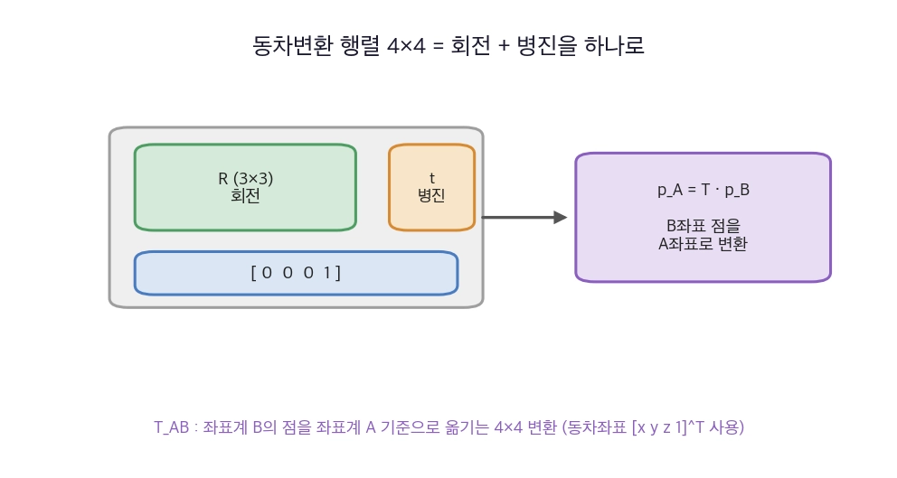
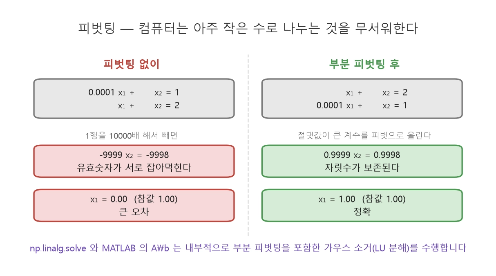
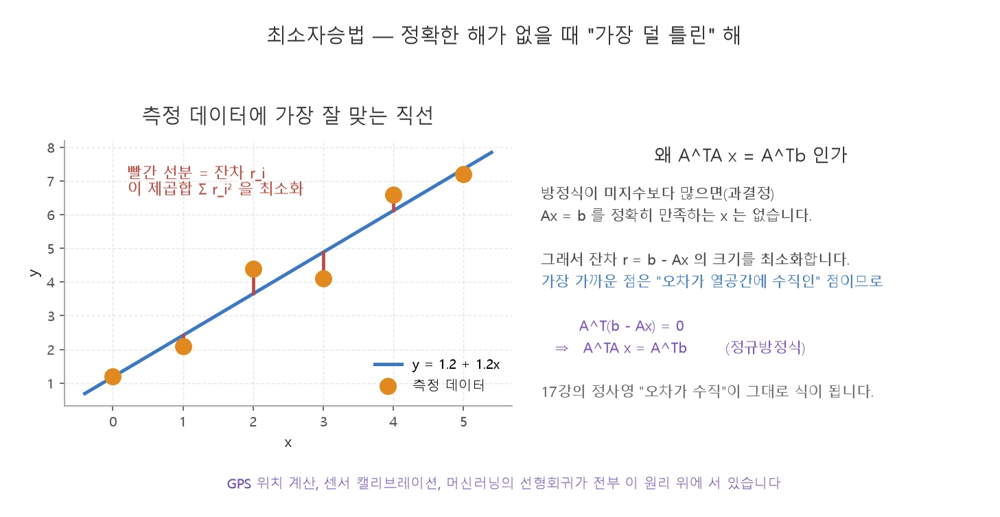

260820
=============
## 19장
### 동차변환
>실제 좌표 변환에는 회전과 병진이 함께 필요

>동차좌표 : $(x, y, z, 1)$  
>차원을 하나 늘리면 회전(곱셈)과 병진(덧셈)을 한 번의 행렬 곱으로 처리  

#### 동차변환행렬
$T = \begin{bmatrix} R & \mathbf{t} \\ \mathbf{0}^{\top} & 1 \end{bmatrix} = \begin{bmatrix} r_{11} & r_{12} & r_{13} & t_x \\ r_{21} & r_{22} & r_{23} & t_y \\ r_{31} & r_{32} & r_{33} & t_z \\ 0 & 0 & 0 & 1 \end{bmatrix}$



>회전 : $R$, 오른쪽 위 열은 병진 : $\mathbf{t}$(위치), 맨 아래 행은 항상 $[0\ 0\ 0\ 1]$ 


$\mathbf{p}_A = T_{AB}\, \mathbf{p}_B \quad\text{(B 좌표계의 점을 A 좌표계로)}
$
### 합성과 역변환
T_{AC} = T_{AB}\, T_{BC}

$\mathbf{p}_{base} = T_{base\_link}\, T_{link\_cam}\, \mathbf{p}_{cam}$

>회전행렬 R은 직교행렬이므로 역행렬과 전치행렬이 동일하므로 $R^{-1}$ = $R^T$ 이다.

$T^{-1} = \begin{bmatrix} R^{\top} & -R^{\top}\mathbf{t} \\ \mathbf{0}^{\top} & 1 \end{bmatrix}$  

### 가우스 소거법


### 피벗팅


>피벗(대각 위치의 수)이 0이면 나눗셈이 불가능  
>0에 가까우면 반올림 오차가 크게 증폭  
>절댓값이 가장 큰 원소를 피벗으로 올리도록 행을 교환하는 부분 피벗팅 사용

### Cramer 공식

$A^{-1} \text{ 존재} \iff \det A \neq 0 \iff \text{rank}\,A = n \iff A\mathbf{x}=\mathbf{b}\text{ 가 유일해를 가짐}$

$A^{-1} = \frac{1}{ad-bc}\begin{bmatrix} d & -b \\ -c & a\end{bmatrix}$

$x_j = \frac{\det A_j}{\det A} \qquad (A_j: A\text{의 } j\text{번째 열을 }\mathbf{b}\text{로 바꾼 행렬})$.

>$O(n!)$ 연산이 필요, 큰 문제에서는 절대 쓰지 않습니다


### 최소자승법

>측정이 미지수보다 훨씬 많은 경우 사용 : 과결정 > 정확한 해가 없습니다. > 오차가 가장 작은 해 사용



$A^{\top}A\,\mathbf{x} = A^{\top}\mathbf{b}$

```python
# NumPy 에서는 정규방정식을 직접 만들지 않고 lstsq 를 씁니다 (수치적으로 더 안정)
coef, residuals, rank, sv = np.linalg.lstsq(A, b, rcond=None)
```

### 포즈 표현

>위치 : 항상 $(x,y,z)$  
>자세 : 세 방식으로 표현

|표현|숫자|장점|단점|주 용도|
|---|---|---|---|------|
|오일러 각|3|사람이 읽기 쉬움|짐벌락, 순서 모호|사람에게 보여줄 때, 설정 파일|
|회전행렬|9|좌표 변환에 바로 곱함|무겁고 오차 누적|좌표 변환 계산|
|쿼터니언|4|보간·합성에 강함, 짐벌락 없음|직관성 낮음|저장·통신·보간|

### 동차변환과 로봇 기구학(DH 표기법)

> 로봇 팔의 링크 하나하나를 동차변환 하나로 표현 순서대로 곱
$T_{base}^{tool} = T_1(\theta_1)\,T_2(\theta_2)\cdots T_n(\theta_n)$

>DH 표기법(Denavit-Hartenberg) : 각 링크의 변환을 네 개의 파라미터(링크 길이·비틀림·오프셋·관절각)로 표준화한 것
>>관절각 $\theta$ 로 미분한 것이 자코비안