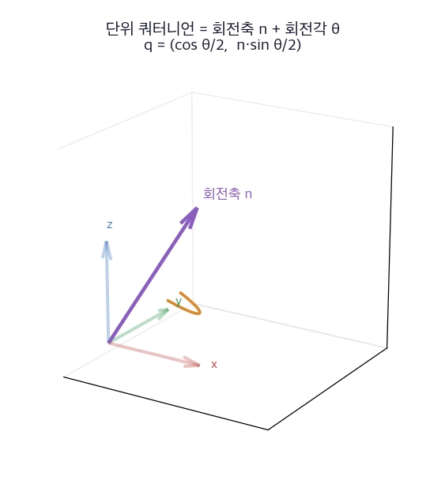
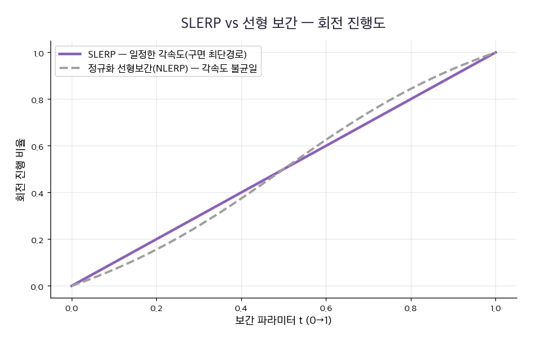
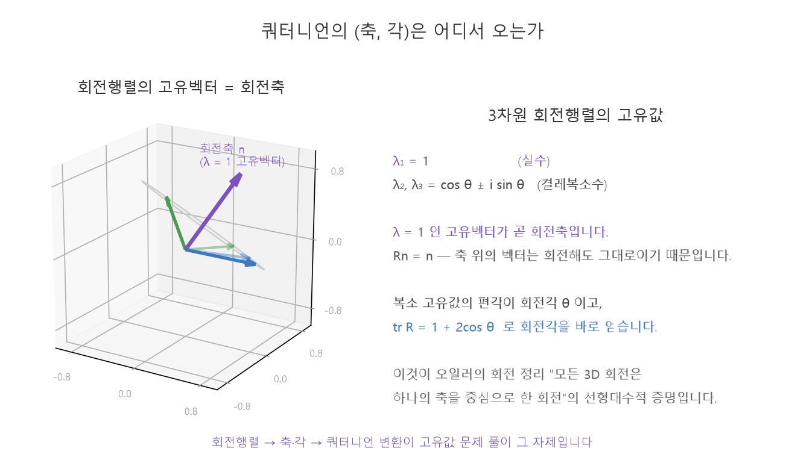
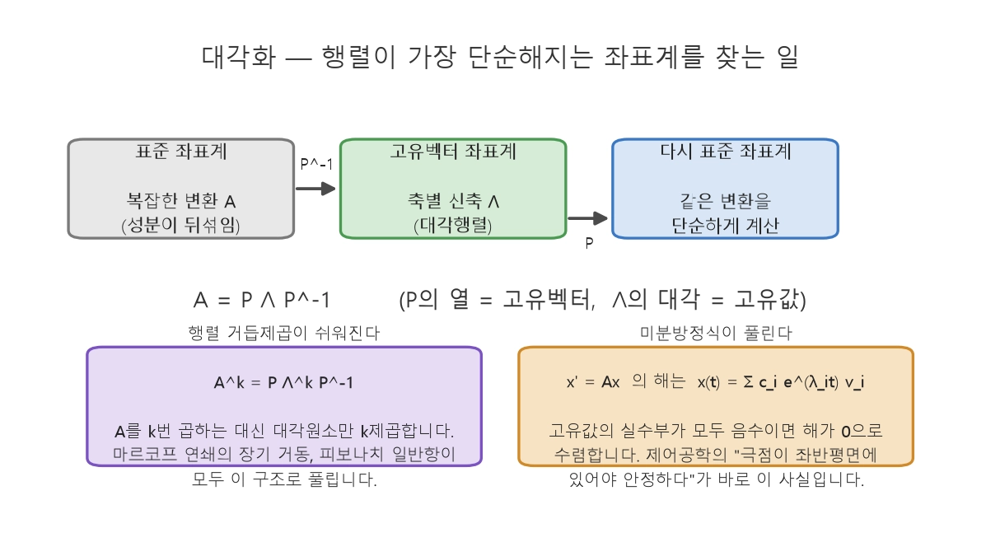

260821
=============
## 20장

### 쿼터니언

> ROS2의 자세 메시지 : 쿼터니언 $(x, y, z, w)$

$q = \left(\cos\frac{\theta}{2},\ n_x\sin\frac{\theta}{2},\ n_y\sin\frac{\theta}{2},\ n_z\sin\frac{\theta}{2}\right) = (w,\ x,\ y,\ z)$

>회전축 : $\mathbf{n}$(어느 방향을 중심으로), 회전각 : $\theta$(얼마나)  
>회전을 표현하는 쿼터니언은 항상 크기가 1인 단위 쿼터니언  
> 장점 : 부드러운 보간, 가벼움과 안정성, 짐벌락 없음

$R = \begin{bmatrix} 1-2(y^2+z^2) & 2(xy-wz) & 2(xz+wy) \\ 2(xy+wz) & 1-2(x^2+z^2) & 2(yz-wx) \\ 2(xz-wy) & 2(yz+wx) & 1-2(x^2+y^2) \end{bmatrix}$

### SLERP

>SLERP : Spherical Linear intERPolation, 구면 선형 보간
>>두 자세를 구면 위 최단 호를 일정한 각속도로 지남

$\text{Slerp}(q_0, q_1, t) = \frac{\sin((1-t)\Omega)}{\sin\Omega}q_0 + \frac{\sin(t\Omega)}{\sin\Omega}q_1, \quad t\in[0,1]$

$\Omega$ : 두 쿼터니언 사이 각(내적 $q_0\cdot q_1 = \cos\Omega$)

> 두 자세 사이 궤적 생성에 사용

### 예제)q1을 x축을 기준으로 15도 회전 후 y축을 기준으로 15도 회전하고 q1과 q0=(1,0,0,0)의 SLERP를 구해라  
$sin7.5 = 0.13052619222$  
$q_1=q_y*q_x$  
$= [w₂w₁ - x₂x₁ - y₂y₁ - z₂z₁,w₂x₁ + x₂w₁ + y₂z₁ - z₂y₁,w₂y₁ - x₂z₁ + y₂w₁ + z₂x₁,w₂z₁ + x₂y₁ - y₂x₁ + z₂w₁]$  
$= [(cos7.5)^2,	cos7.5*sin7.5,	-cos7.5*sin7.5, (sin7.5)^2]$  
$= [0.9830,0.1294,-0.1294,0.0170]$  
$q_0 = [1,0,0,0]$  
$q_0,q_1 내적 = 0.9830$  
$lamda = 10.5798441$  
$t = 0.5$  
$sin 10.5798441 = 0.18360555553$  
$sin (t*lamda) = 0.0921954446$  
$SLERP(q_0,q_1,t) = [0.9957,0.0650,-0.0650,0.0085]$  

260824
=============
## 20장

### 고유값과 고유벡터, 회전축

>$A\mathbf{v} = \lambda\mathbf{v} \qquad (\mathbf{v} \neq \mathbf{0})$  
에서의 $\lambda$ : 고유값(eigenvalue), 벡터 $\mathbf{v}$ : 고유벡터(eigenvector)

>$A$ 를 곱하면 고유벡터는 방향이 그대로 유지되고 크기만 $\lambda$ 배 

>특성방정식 : $\det(A - \lambda I) = 0$
>>특성방정식의근이 고유값  
>>검산 공식 : $\sum_i \lambda_i = \text{tr}\,A \ (\text{대각합}), \qquad \prod_i \lambda_i = \det A$

> 고유값은 $\lambda_1 = 1$(실수), $\lambda_{2,3} = \cos\theta \pm i\sin\theta$(켤레복소수)  
>$\lambda=1$ 인 고유벡터가 곧 회전축

$\text{tr}\,R = 1 + 2\cos\theta \quad\Longrightarrow\quad \theta = \arccos\frac{\text{tr}\,R - 1}{2}$

>오일러의 회전 정리 : 모든 3D 회전은 하나의 축을 중심으로 한 회전이다

### 대각화

>대각화 : $n\times n$ 행렬 $A$ 가 $n$ 개의 선형독립인 고유벡터를 가지고 이들을 열로 쌓은 $P$에 대해서 $A = P\Lambda P^{-1}, \qquad \Lambda = \text{diag}(\lambda_1, \ldots, \lambda_n)$
>>행렬이 가장 단순하게 보이는 좌표계(고유벡터 기저)를 찾는 작업

>$A=\begin{bmatrix}2&1\\0&2\end{bmatrix}$ 처럼 고유값은 중복인데 독립인 고유벡터가 부족하면 대각화할 수 없음

