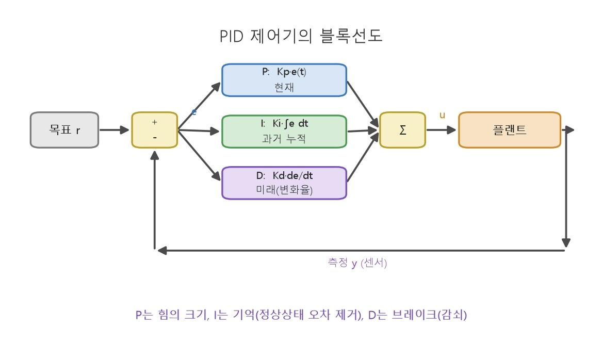
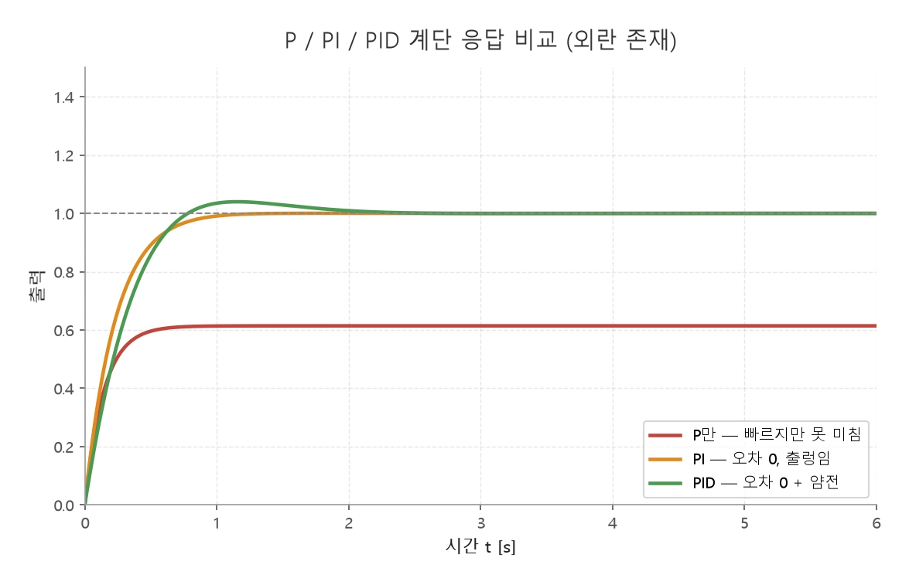

# 3강

## PID

- $u(t) = K_p\, e(t) + K_i \int_0^t e(\sigma)\, d\sigma + K_d\, \frac{de(t)}{dt}$

|항	보는 것|직관|키우면 좋아지는 것|키우면 나빠지는 것|
|--------|---|--------------|--------------|
|P (비례)|현재 오차|"벗어난 만큼 민다"|응답 빨라짐, 오차 감소|오버슈트·진동 증가, 오차를 0으로는 못 만듦|
|I (적분)|과거 오차의 누적|"계속 모자라면 더 민다"|정상상태 오차 제거|응답 느려짐, 오버슈트 증가, 와인드업 위험|
|D (미분)|미래 (오차의 변화율)|"빠르게 접근 중이면 미리 브레이크"|오버슈트·진동 억제(감쇠 추가)|센서 노이즈 증폭, 튜닝 까다로움|

## P,PI,PID

|제어기|$K_P$|$K_I$|$K_D$|
|----|------|-----|-----|
|P|0.50$K_u$|0|0|
|PI|0.45$K_u$|0.54$K_u/T_u$|0|
|PID|0.60$K_u$|1.2$K_u/T_u$|0.075$K_uT_u$|

- $K_u$ = 25
- $T_u$ = 2
- PID >> $K_P$ = 15, $K_I$ = 15, $K_D$ = 3.75

### 위상마진

- P(비례)나 I(적분) 제어만 쓰면 목표 잔여 값을 빨리 없애려고 무조건 세게,  
- 이로 인해 타이밍이 늦어져 위상이 지연, 불안정한 상태(낮은 위상마진)  
- 여기에 D(미분) 제어기를 달아주면, 잔여 값의 감소 속도를 감시, 미리 브레이크  
- 덕분에 시스템의 위상이 밀리지 않고 결과적으로 위상마진이 높아짐(안전 여유가 생김)