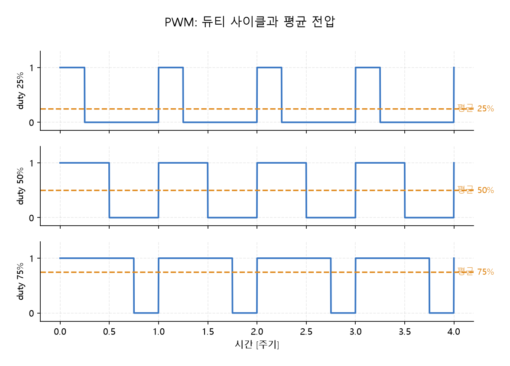

# 4강

## MCU


### I2C vs UART

|구분|UART (비동기식)|I2C (동기식)|
|---|--------------|----------|
|선 연결 (핀 수)|2개 (TX, RX)|2개 (SDA, SCL)|
|통신 방식|양방향 동시 가능 (전이중 / Full-Duplex)|양방향 가능하나, 한 번에 한 방향만 (반이중 / Half-Duplex)|
|클럭(SCL)선|없음 (서로 속도를 미리 맞춰야 함)|있음 (클럭 신호에 맞춰 데이터 전송)|
|연결 가능한 장치|1 대 1 통신만 가능|1 대 N 통신 가능 (최대 127대)|
|주요 용도|PC와 MCU 연결, 블루투스 모듈 등|기판 내부의 센서, 디스플레이(OLED) 연결 등|

### SBC vs MCU

- SBC : 영상 처리 , 인식, 상위 계획
- MCU : 센서 획득, 주기, 제어, 구동 신호

|구분|PC/SBC (라즈베리파이)|MCU (STM32)|
|---|------------------|-----------|
|클럭|GHz대|수십~수백 MHz|
|메모리|GB (DRAM)|KB~MB (SRAM+Flash)|
|OS|리눅스 (프로세스·가상 메모리)|없음(bare-metal) 또는 RTOS|
|인터럽트 지연|수십 µs~ms, 가변|수백 ns, 결정적|
|부팅|수십 초|수 ms|
|역할|인지·판단 (Soft/Firm)|제어 (Hard 실시간)|

### 메모리맵

|주소 영역|내용|
|-------|---|
|0x0800 0000|Flash — 프로그램 코드 (전원 꺼져도 유지)
|0x2000 0000|SRAM — 전역/지역 변수, 스택|
|0x4000 0000|주변장치 레지스터 — GPIO·타이머·ADC 설정/데이터|

```java
// bare-metal: GPIOA의 출력 데이터 레지스터(ODR) 5번 비트를 1로
GPIOA->ODR |= (1 << 5);            // 레지스터 직접 조작

// HAL(추상화 라이브러리): 같은 일을 함수로
HAL_GPIO_WritePin(GPIOA, GPIO_PIN_5, GPIO_PIN_SET);
```

### 툴체인

- 소스(.c) → arm-none-eabi-gcc 컴파일 → 링크(링커 스크립트가 Flash/SRAM 주소 배치 결정) → .elf/.bin → ST-LINK(보드에 내장된 프로그래머)로 Flash에 굽기 → 리셋 후 실행

## GPIO

- 핀 하나를 소프트웨어로 읽고 쓰는 가장 기본 주변장치
  - 출력 모드 : 핀을 High(3.3V)/Low(0V)로 만듭니다
    - LED, 릴레이, 모터 드라이버의 방향(DIR) 핀.
  - 입력 모드 : 핀의 전압을 0/1로 읽습니다
    - 버튼, 리밋 스위치, 엔코더 신호.
  - 풀업/풀다운 : 아무것도 연결 안 된 입력 핀은 전압이 떠 있어 0과 1 사이에서 요동, 내부 저항으로 기본값을 High(풀업) 또는 Low(풀다운)로 고정.

## 인터럽트 vs 폴링

- 폴링 : 루프에서 계속 확인하여 CPU를 독점하고 다른 일을 하는 동안 놓칠 수 있음
- 인터럽트 : 하드웨어가 이벤트를 감지하면 CPU가 하던 일을 멈추고 등록된 함수로 점프했다가 복귀


## PWM

- 켜져 있는 시간의 비율을 조절



- 듀티 사이클 : 주기 $T$ 안에서 High인 시간의 비율
  - 스위칭이 모터의 기계적 시정수보다 빠르면, 관성 때문에 모터는 평균값만

- $V_{\text{평균}} = V_{\text{전원}} \times \text{duty} \qquad (0 \le \text{duty} \le 1)$
- DC 모터 : 보통 수 kHz~20kHz PWM. 듀티가 곧 속도(힘) 명령
- 서보 모터(RC 서보) : 주기 20ms(50Hz) 고정, 듀티가 아니라 펄스 폭이 명령
- PID의 출력 $u$ : PWM 듀티