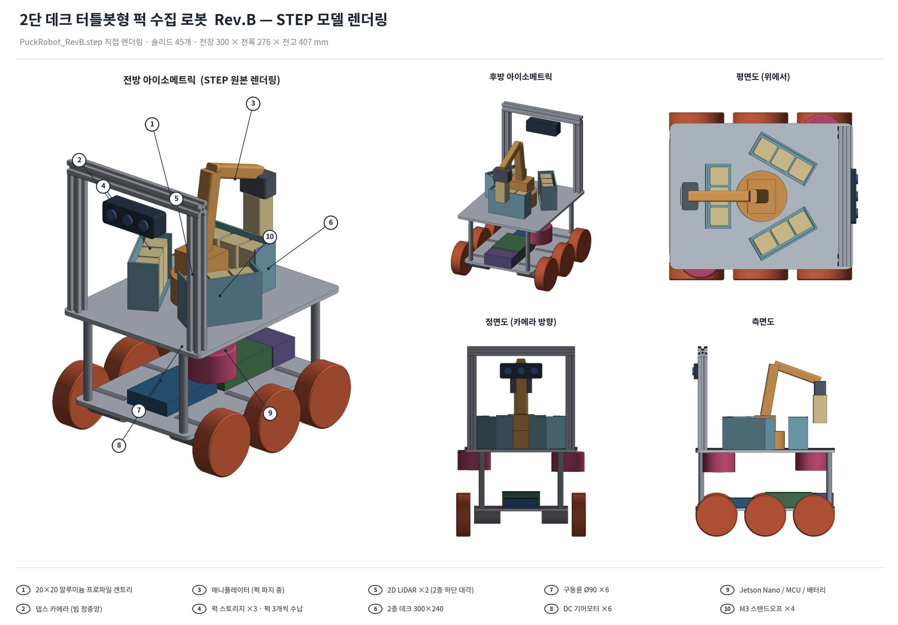

# Restart
```shell
export BASE="$HOME/pa-opencr-build"
set -o pipefail
cd "$BASE/uploader-src"
ls -l /dev/ttyACM*
PORT=/dev/ttyACM0
python3 -m serial.tools.miniterm "$PORT" 115200 --eol LF
```

# assignment2 module 1

## tmux

```bash
tmux new -s lab       # 처음 만들 때
tmux attach -t lab    # 재접속 후 다시 들어갈 때
tmux ls               # 살아 있는 세션 목록
tmux detach-client -s lab # tmux 종료
```

# Project 2

## 0922 회의록

<aside>

### ✅ 오늘의 성과

</aside>

#### **로봇 구조 전면 재구성**

<aside>

### ✅ 오늘의 회의록

</aside>

#### **1. 층 구성**

- **AS-IS  : 1층(**바퀴+배터리**) + 2층(**라즈베리파이**+**OpenCR**) + 3층(**퍽스토리지+카메라+라이다**)**
- **TO-BE : 1층(바퀴+**라즈베리파이**+**OpenCR) + 2층(퍽스토리지+카메라+라이다)
- **3층 → 2층으로 변경**

#### **2. 퍽 스토리지 방식 논의**

- 퍽 스토리지 재장전 방식의 문제점 발견 → **잼 문제 발생 가능**
- 3층 퍽 스토리지에 **걸쇠 방식을 추가**하여 개선 가능 한지 **확인 필요**
- 퍽 스토리지의 퍽을 꺼내고 넣기 좋게 부분적으로 오픈 되어있는 구조로?

#### **3. 바퀴 구성**

- **AS-IS  :** 2륜(모터 있음) + 4륜(모터 없음. 보조)
- **TO-BE : 6륜(모터 있음) → 선생님 의견 반영**

#### **4. 라이다**

- **AS-IS  :** 3층 상부 대각선 2개씩
- **TO-BE :** 2층 하부 대각선 2개씩

#### **5. 카메라**

- 변화 없음
- 뎁스 카메라 2층 상부 2개 + 매뉴퓰레이터 1개

#### **6. 매뉴 퓰레이터**

- 중앙에 설치
- 관절이 최대한 펴지지 않도록 하는게 관건
- 상단부에 위치 시, **펴지면 펴질수록 무게 중심이 변화**하여 **최소한의 움직임으로 퍽들을 컨트롤** 할 수 있도록 해야함.

#### **7. 라즈베리 파이**

- AS-IS : 하단부에 가로로 눕펴서 2개 설치
- TO-BE : 하단부에 **세로로 눕혀서** 2개 설치.
  - 젯슨 나노 지급 예정으로 추후 조정 예정

#### **8.  프로토 타입 구성**



<aside>

### ✅ 다음 회의 일정 & 주요 안건

</aside>

1. **부품 관련**
- 모터 브라켓
- 라즈베리 파이 브라켓
1. **설계**
- 퍽 스토리지 설계 (회전형 / 걸쇠형)

1. **신청 필요 사항**
- 연장 부품 신청
- 프로파일 신청

## 0923 회의록
